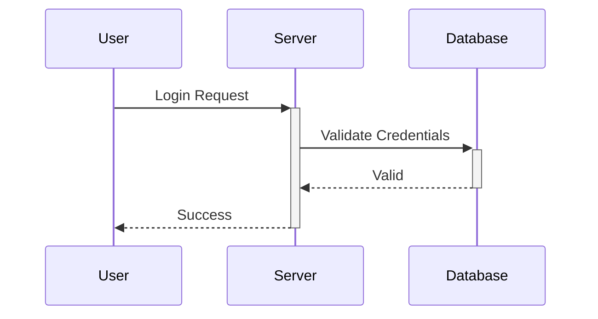

# MCP Server for Cursor Integration

## Table of Contents
- [Setup](#setup)
- [Available Tools](#available-tools)
  - [Jira Tools](#jira-tools)
    - [get_ticket_by_key](#get_ticket_by_key)
    - [transition_ticket](#transition_ticket)
    - [list_tickets_by_team_and_status](#list_tickets_by_team_and_status)
    - [add_code_reviewer](#add_code_reviewer)
    - [list_tickets_by_sprint_and_team](#list_tickets_by_sprint_and_team)
  - [Confluence Tools](#confluence-tools)
    - [test_confluence_connection](#test_confluence_connection)
    - [get_confluence_page](#get_confluence_page)
  - [Diagram Tools](#diagram-tools)
    - [generate_diagram](#generate_diagram)
    - [add_diagram_to_confluence](#add_diagram_to_confluence)
- [Project Structure](#project-structure)
- [Development](#development)
- [Troubleshooting](#troubleshooting)
- [Contributing](#contributing)
- [License](#license)

This MCP (Model Context Protocol) server provides integration with Jira, Confluence, and diagram generation capabilities for use with the Cursor IDE.

## Setup

1. Clone this repository
2. Install dependencies:
   ```bash
   npm install
   ```
3. Copy the example configuration:
   ```bash
   cp .cursor/mcp.json.example .cursor/mcp.json
   ```
4. Update `.cursor/mcp.json` with your credentials:
   - Jira API token
   - Confluence API token
   - Base URLs for both services

5. Start the server from Cursor:
   - Open Cursor IDE
   - Go to Settings (⌘,)
   - Navigate to "Cursor Settings"
   - Under "MCP Server", click "Start Server"
   - Select this project's directory

## Available Tools

### Jira Tools

#### `get_ticket_by_key`
Fetches a Jira ticket by its key (e.g., STK-1234).
```typescript
{
  key: string  // Jira ticket key
}
```
Example prompts:
- "Show me the details for ticket STK-1234"
- "What's the status of STOCK-5678?"
- "Get information about the ticket STK-9012"

#### `transition_ticket`
Transitions a Jira ticket to a new status.
```typescript
{
  key: string,    // Jira ticket key
  status: string  // Target status
}
```
Example prompts:
- "Move ticket STK-1234 to Code Review"
- "Transition STOCK-5678 to Done"
- "Update the status of STK-9012 to In Progress"

#### `list_tickets_by_team_and_status`
Lists tickets for a specific team and status.
```typescript
{
  team: string,   // Team name (e.g., "EComm Demand")
  status: string  // Ticket status (e.g., "Code Review")
}
```
Example prompts:
- "Show me all Code Review tickets for EComm Demand team"
- "List In Progress tickets for EComm LTV"
- "What tickets are in QA for the Stock team?"

#### `add_code_reviewer`
Adds a code reviewer to one or more tickets.
```typescript
{
  keys: string[],  // Array of Jira ticket keys
  username: string // Username to add as reviewer
}
```
Example prompts:
- "Add adelmann as reviewer to STK-1234"
- "Set jsmith as code reviewer for STOCK-5678 and STOCK-5679"
- "Add code reviewer mmiller to these tickets: STK-1234, STK-1235"

#### `list_tickets_by_sprint_and_team`
Lists tickets for a specific sprint and team.
```typescript
{
  sprint: string, // Sprint name (e.g., "STK Sprint 253")
  team: string    // Team name (e.g., "EComm LTV")
}
```
Example prompts:
- "Show tickets for EComm LTV in STK Sprint 253"
- "List all EComm Demand tickets in the current sprint"
- "What's in Sprint 254 for the Stock team?"

### Confluence Tools

#### `test_confluence_connection`
Tests the connection to Confluence.

Example prompts:
- "Test the Confluence connection"
- "Check if Confluence is working"
- "Verify Confluence credentials"

#### `get_confluence_page`
Retrieves a Confluence page by its ID.
```typescript
{
  pageId: string,           // Confluence page ID
  format?: "markdown" | "html" | "both" // Output format (default: "markdown")
}
```
Example prompts:
- "Show me Confluence page 3506530385"
- "Get the content of wiki page 1234567890"
- "Fetch Confluence page 9876543210 in HTML format"

### Diagram Tools

#### `generate_diagram`
Generates a diagram using Mermaid syntax and saves it as an image.
```typescript
{
  code: string,     // Mermaid diagram code
  filename?: string // Optional filename for the diagram
}
```
Example prompts:
- "Create a sequence diagram showing user authentication flow"
- "Generate a class diagram for the Cart system"
- "Make a flowchart showing the checkout process"
- "Create a diagram from this code file"
- "Analyze this class and create a diagram"

Example Mermaid code:


#### `add_diagram_to_confluence`
Adds a Mermaid diagram to a Confluence page.
```typescript
{
  pageId: string,      // Confluence page ID
  mermaidCode: string, // Mermaid diagram code
  position?: string    // Where to add the diagram (top or bottom)
}
```
Example prompts:
- "Add this diagram to Confluence page 3506530385"
- "Insert the sequence diagram at the top of page 1234567890"
- "Update wiki page 9876543210 with this architecture diagram"

## Project Structure

```
.
├── .cursor/              # Cursor configuration
│   ├── mcp.json         # Your configuration (not in git)
│   └── mcp.json.example # Example configuration
├── diagrams/            # Generated diagrams (contents not in git)
├── services/           # Service implementations
├── utils/             # Utility functions
├── middleware/        # Middleware components
└── server.js         # Main server file
```

## Development

- Generated diagrams are stored in the `diagrams/` directory but not tracked in git
- The server uses Node.js and the MCP SDK
- All tools are registered in `server.js`

## Troubleshooting

1. If the server fails to start:
   - Check that `.cursor/mcp.json` exists and has valid credentials
   - Ensure no other MCP server is running
   - Check the Cursor console for error messages

2. If tools aren't appearing in Cursor:
   - Restart the MCP server from Cursor Settings
   - Check that the tool is properly registered in `server.js`

3. If diagram generation fails:
   - Ensure `@mermaid-js/mermaid-cli` is installed globally:
     ```bash
     npm install -g @mermaid-js/mermaid-cli
     ```

## Contributing

1. Fork the repository
2. Create a feature branch
3. Make your changes
4. Submit a pull request

## License

This project is proprietary and confidential. © Adobe Systems Incorporated.